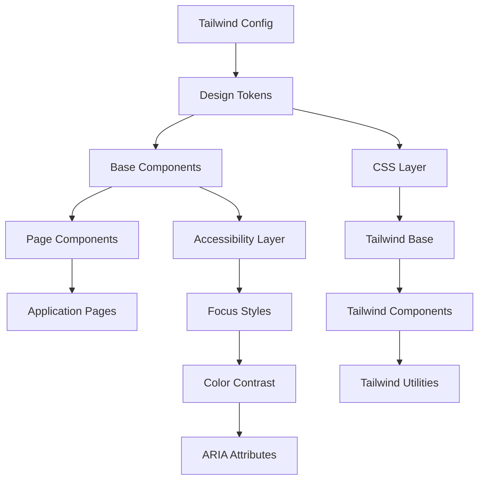
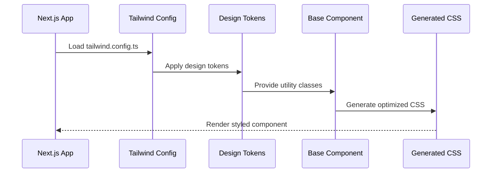
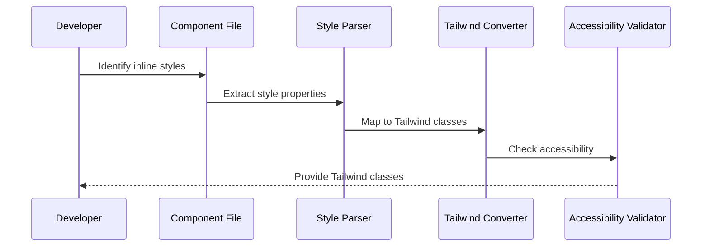

# Design Document: Tailwind Design System

## Overview

This design document outlines the implementation of a comprehensive design system using Tailwind CSS for the Health Watchers web application. The system will replace all inline style={{}} props with a consistent, accessible, and maintainable design system built on Tailwind utility classes. The design system includes design tokens, reusable components, and accessibility standards that ensure WCAG AA compliance while maintaining build compatibility in the existing Next.js monorepo structure.

The transformation involves configuring Tailwind CSS, establishing design tokens for colors, typography, and spacing, creating a component library with base layout components, and systematically replacing all inline styles throughout the application. This approach will improve code maintainability, design consistency, and accessibility while providing a scalable foundation for future development.

## Architecture



## Sequence Diagrams

### Component Rendering Flow



### Style Migration Process



## Components and Interfaces

### Component 1: TailwindProvider

**Purpose**: Provides Tailwind CSS configuration and design tokens to the application

**Interface**:
```typescript
interface TailwindConfig {
  theme: {
    colors: ColorPalette
    typography: TypographyScale
    spacing: SpacingScale
    screens: BreakpointMap
  }
  plugins: Plugin[]
}

interface DesignTokens {
  colors: ColorPalette
  typography: TypographyScale
  spacing: SpacingScale
}
```

**Responsibilities**:
- Configure Tailwind CSS with custom design tokens
- Provide consistent color palette across application
- Define typography scale and spacing system
- Enable responsive design breakpoints

### Component 2: BaseComponent System

**Purpose**: Provides reusable UI components with consistent styling and accessibility

**Interface**:
```typescript
interface BaseComponentProps {
  className?: string
  children?: React.ReactNode
  'data-testid'?: string
}

interface ButtonProps extends BaseComponentProps {
  variant: 'primary' | 'secondary' | 'danger'
  size: 'sm' | 'md' | 'lg'
  disabled?: boolean
  onClick?: () => void
}

interface InputProps extends BaseComponentProps {
  type: 'text' | 'email' | 'password' | 'number'
  placeholder?: string
  value?: string
  onChange?: (value: string) => void
  error?: string
}
```

**Responsibilities**:
- Provide consistent component API
- Implement accessibility standards
- Support theming through Tailwind classes
- Handle component state and interactions

### Component 3: LayoutComponents

**Purpose**: Provides structural layout components for consistent page structure

**Interface**:
```typescript
interface PageWrapperProps extends BaseComponentProps {
  maxWidth?: 'sm' | 'md' | 'lg' | 'xl' | 'full'
  padding?: boolean
}

interface PageHeaderProps extends BaseComponentProps {
  title: string
  subtitle?: string
  actions?: React.ReactNode
}

interface CardProps extends BaseComponentProps {
  padding?: 'sm' | 'md' | 'lg'
  shadow?: boolean
  border?: boolean
}
```

**Responsibilities**:
- Provide consistent page layout structure
- Implement responsive design patterns
- Support flexible content arrangement
- Maintain visual hierarchy

## Data Models

### Model 1: ColorPalette

```typescript
interface ColorPalette {
  primary: {
    50: string
    100: string
    200: string
    300: string
    400: string
    500: string
    600: string
    700: string
    800: string
    900: string
    950: string
  }
  secondary: ColorScale
  success: ColorScale
  warning: ColorScale
  error: ColorScale
  neutral: ColorScale
}

type ColorScale = {
  50: string
  100: string
  200: string
  300: string
  400: string
  500: string
  600: string
  700: string
  800: string
  900: string
  950: string
}
```

**Validation Rules**:
- All colors must meet WCAG AA contrast ratio (4.5:1) when used with text
- Primary colors must have sufficient contrast against white and dark backgrounds
- Color values must be valid hex, RGB, or HSL format

### Model 2: TypographyScale

```typescript
interface TypographyScale {
  fontFamily: {
    sans: string[]
    serif: string[]
    mono: string[]
  }
  fontSize: {
    xs: [string, { lineHeight: string }]
    sm: [string, { lineHeight: string }]
    base: [string, { lineHeight: string }]
    lg: [string, { lineHeight: string }]
    xl: [string, { lineHeight: string }]
    '2xl': [string, { lineHeight: string }]
    '3xl': [string, { lineHeight: string }]
    '4xl': [string, { lineHeight: string }]
  }
  fontWeight: {
    normal: string
    medium: string
    semibold: string
    bold: string
  }
}
```

**Validation Rules**:
- Font sizes must maintain readable line heights (1.4-1.6 ratio)
- Font families must include fallback system fonts
- Font weights must be available in selected font families

### Model 3: SpacingScale

```typescript
interface SpacingScale {
  0: string
  px: string
  0.5: string
  1: string
  1.5: string
  2: string
  2.5: string
  3: string
  3.5: string
  4: string
  5: string
  6: string
  7: string
  8: string
  9: string
  10: string
  11: string
  12: string
  14: string
  16: string
  20: string
  24: string
  28: string
  32: string
  36: string
  40: string
  44: string
  48: string
  52: string
  56: string
  60: string
  64: string
  72: string
  80: string
  96: string
}
```

**Validation Rules**:
- Spacing values must follow consistent mathematical progression
- Values must be provided in rem units for accessibility
- Minimum spacing must be at least 4px for touch targets

## Algorithmic Pseudocode

### Main Processing Algorithm

```pascal
ALGORITHM implementTailwindDesignSystem(webApp)
INPUT: webApp of type NextJsApplication
OUTPUT: result of type TransformationResult

BEGIN
  ASSERT webApp.hasPackageJson() = true
  ASSERT webApp.framework = "Next.js"
  
  // Step 1: Install and configure Tailwind CSS
  dependencies ← installTailwindDependencies(webApp)
  config ← createTailwindConfig(webApp, designTokens)
  
  // Step 2: Create design token system
  tokens ← defineDesignTokens()
  ASSERT validateColorContrast(tokens.colors) = true
  
  // Step 3: Replace inline styles with Tailwind classes
  FOR each file IN webApp.componentFiles DO
    ASSERT hasInlineStyles(file) = true OR hasInlineStyles(file) = false
    
    IF hasInlineStyles(file) THEN
      transformedFile ← replaceInlineStyles(file, tokens)
      validateAccessibility(transformedFile)
      webApp.updateFile(file, transformedFile)
    END IF
  END FOR
  
  // Step 4: Create base components
  components ← createBaseComponents(tokens)
  FOR each component IN components DO
    ASSERT component.hasAccessibilityFeatures() = true
    ASSERT component.hasProperFocusStyles() = true
  END FOR
  
  // Step 5: Validate build compatibility
  buildResult ← webApp.build()
  ASSERT buildResult.success = true
  
  result ← createTransformationResult(dependencies, config, tokens, components, buildResult)
  
  ASSERT result.noInlineStylesRemain() = true
  ASSERT result.wcagAACompliant() = true
  
  RETURN result
END
```

**Preconditions:**
- webApp is a valid Next.js application
- webApp has package.json and valid project structure
- webApp.componentFiles contains React components with inline styles

**Postconditions:**
- All inline style={{}} props are replaced with Tailwind classes
- Design token system is properly configured
- Base components are created with accessibility features
- Build process succeeds with Tailwind configuration
- WCAG AA compliance is maintained

**Loop Invariants:**
- All processed files maintain valid React component structure
- Accessibility standards are preserved throughout transformation
- Build compatibility is maintained at each step

### Style Transformation Algorithm

```pascal
ALGORITHM replaceInlineStyles(componentFile, designTokens)
INPUT: componentFile of type ReactComponent, designTokens of type DesignTokens
OUTPUT: transformedFile of type ReactComponent

BEGIN
  ASSERT componentFile.isValidReactComponent() = true
  
  // Parse component for inline styles
  inlineStyles ← extractInlineStyles(componentFile)
  
  // Transform each inline style to Tailwind classes
  FOR each styleObject IN inlineStyles DO
    ASSERT styleObject.isValidCSSObject() = true
    
    tailwindClasses ← []
    
    FOR each property IN styleObject.properties DO
      tailwindClass ← mapCSSPropertyToTailwind(property, designTokens)
      
      IF tailwindClass ≠ null THEN
        tailwindClasses.add(tailwindClass)
      ELSE
        // Handle unmappable properties with custom CSS
        customCSS ← createCustomCSSClass(property)
        tailwindClasses.add(customCSS)
      END IF
    END FOR
    
    // Replace inline style with className
    componentFile ← replaceStyleWithClassName(componentFile, styleObject, tailwindClasses)
  END FOR
  
  // Validate accessibility after transformation
  ASSERT validateAccessibility(componentFile) = true
  
  RETURN componentFile
END
```

**Preconditions:**
- componentFile is a valid React component
- designTokens contains complete color, typography, and spacing definitions
- All inline styles use valid CSS properties

**Postconditions:**
- All inline styles are replaced with Tailwind utility classes
- Component maintains original visual appearance
- Accessibility features are preserved or enhanced
- Component remains syntactically valid

**Loop Invariants:**
- All processed style properties maintain visual equivalence
- Component structure remains valid throughout transformation
- Accessibility standards are maintained for each processed element

### Accessibility Validation Algorithm

```pascal
ALGORITHM validateAccessibility(component)
INPUT: component of type ReactComponent
OUTPUT: isAccessible of type boolean

BEGIN
  ASSERT component.isValidReactComponent() = true
  
  accessibilityChecks ← []
  
  // Check color contrast ratios
  FOR each textElement IN component.textElements DO
    contrast ← calculateColorContrast(textElement.color, textElement.backgroundColor)
    
    IF textElement.fontSize < 18px THEN
      ASSERT contrast ≥ 4.5  // WCAG AA normal text
    ELSE
      ASSERT contrast ≥ 3.0  // WCAG AA large text
    END IF
    
    accessibilityChecks.add(contrast ≥ requiredRatio)
  END FOR
  
  // Check focus styles for interactive elements
  FOR each interactiveElement IN component.interactiveElements DO
    ASSERT interactiveElement.hasFocusStyles() = true
    ASSERT interactiveElement.focusStyles.isVisible() = true
    
    accessibilityChecks.add(interactiveElement.hasFocusStyles())
  END FOR
  
  // Check ARIA attributes for complex components
  FOR each complexElement IN component.complexElements DO
    IF complexElement.requiresARIA() THEN
      ASSERT complexElement.hasRequiredARIAAttributes() = true
      accessibilityChecks.add(complexElement.hasRequiredARIAAttributes())
    END IF
  END FOR
  
  // All checks must pass
  FOR each check IN accessibilityChecks DO
    IF check = false THEN
      RETURN false
    END IF
  END FOR
  
  RETURN true
END
```

**Preconditions:**
- component is a valid React component
- component contains styled elements
- Color values are in valid format for contrast calculation

**Postconditions:**
- Returns true if and only if component meets WCAG AA standards
- All interactive elements have proper focus styles
- All text meets minimum contrast requirements
- Complex elements have required ARIA attributes

**Loop Invariants:**
- All previously checked elements maintain accessibility compliance
- Accessibility validation state remains consistent throughout iteration

## Key Functions with Formal Specifications

### Function 1: createTailwindConfig()

```typescript
function createTailwindConfig(designTokens: DesignTokens): TailwindConfig
```

**Preconditions:**
- `designTokens` is non-null and contains valid color, typography, and spacing definitions
- `designTokens.colors` meets WCAG AA contrast requirements
- `designTokens.typography` includes valid font families and sizes

**Postconditions:**
- Returns valid TailwindConfig object
- Config includes all design tokens properly mapped
- Config enables responsive design and accessibility features
- Generated CSS will be optimized for production builds

**Loop Invariants:** N/A (no loops in function)

### Function 2: mapCSSPropertyToTailwind()

```typescript
function mapCSSPropertyToTailwind(property: CSSProperty, tokens: DesignTokens): string | null
```

**Preconditions:**
- `property` is a valid CSS property with name and value
- `tokens` contains complete design token definitions
- Property value is in valid CSS format

**Postconditions:**
- Returns Tailwind utility class string if mapping exists
- Returns null if no direct mapping available
- Returned class maintains visual equivalence to original property
- Returned class follows Tailwind naming conventions

**Loop Invariants:** N/A (no loops in function)

### Function 3: validateColorContrast()

```typescript
function validateColorContrast(foreground: string, background: string): number
```

**Preconditions:**
- `foreground` and `background` are valid color values (hex, RGB, or HSL)
- Colors are in format that can be converted to RGB for calculation

**Postconditions:**
- Returns contrast ratio as number between 1 and 21
- Calculation follows WCAG contrast ratio formula
- Result can be compared against WCAG AA/AAA thresholds (4.5:1, 7:1)

**Loop Invariants:** N/A (no loops in function)

## Example Usage

```typescript
// Example 1: Basic Tailwind configuration
const tailwindConfig = createTailwindConfig({
  colors: {
    primary: {
      500: '#3B82F6',
      600: '#2563EB',
      700: '#1D4ED8'
    }
  },
  typography: {
    fontSize: {
      base: ['16px', { lineHeight: '24px' }]
    }
  },
  spacing: {
    4: '1rem',
    8: '2rem'
  }
})

// Example 2: Component transformation
// Before: inline styles
const OldComponent = () => (
  <div style={{ padding: '2rem', fontFamily: 'sans-serif' }}>
    <h1 style={{ fontSize: '24px', fontWeight: 'bold' }}>Title</h1>
  </div>
)

// After: Tailwind classes
const NewComponent = () => (
  <div className="p-8 font-sans">
    <h1 className="text-2xl font-bold">Title</h1>
  </div>
)

// Example 3: Base component usage
const Button = ({ variant, size, children, ...props }) => {
  const baseClasses = 'inline-flex items-center justify-center rounded-md font-medium transition-colors focus:outline-none focus:ring-2 focus:ring-offset-2'
  const variantClasses = {
    primary: 'bg-blue-600 text-white hover:bg-blue-700 focus:ring-blue-500',
    secondary: 'bg-gray-200 text-gray-900 hover:bg-gray-300 focus:ring-gray-500'
  }
  const sizeClasses = {
    sm: 'px-3 py-2 text-sm',
    md: 'px-4 py-2 text-base',
    lg: 'px-6 py-3 text-lg'
  }
  
  return (
    <button 
      className={`${baseClasses} ${variantClasses[variant]} ${sizeClasses[size]}`}
      {...props}
    >
      {children}
    </button>
  )
}

// Example 4: Complete page transformation
const PatientsPage = () => (
  <PageWrapper>
    <PageHeader title="Patients" />
    <Card>
      <Table>
        <TableHeader>
          <TableRow>
            <TableHead>ID</TableHead>
            <TableHead>Name</TableHead>
            <TableHead>DOB</TableHead>
          </TableRow>
        </TableHeader>
        <TableBody>
          {patients.map(patient => (
            <TableRow key={patient.id}>
              <TableCell>{patient.id}</TableCell>
              <TableCell>{patient.name}</TableCell>
              <TableCell>{patient.dob}</TableCell>
            </TableRow>
          ))}
        </TableBody>
      </Table>
    </Card>
  </PageWrapper>
)
```

## Correctness Properties

*A property is a characteristic or behavior that should hold true across all valid executions of a system-essentially, a formal statement about what the system should do. Properties serve as the bridge between human-readable specifications and machine-verifiable correctness guarantees.*

### Property 1: No Inline Styles After Transformation

*For any* component file in the application, after the migration process is complete, there should be zero instances of inline style={{}} props.

**Validates: Requirements 3.3**

### Property 2: CSS Property to Tailwind Class Mapping

*For any* valid CSS property with a corresponding Tailwind utility class, the migration system should correctly map the property to its equivalent Tailwind class while maintaining visual equivalence.

**Validates: Requirements 3.2**

### Property 3: Color Contrast Compliance

*For any* text element and background color combination in the design system, the color contrast ratio should meet or exceed WCAG AA standards (4.5:1 for normal text, 3.0:1 for large text).

**Validates: Requirements 2.4, 5.2**

### Property 4: Build System Success

*For any* properly configured Tailwind CSS project, running the build command should complete successfully without compilation errors.

**Validates: Requirements 1.5, 6.1**

### Property 5: Component Accessibility Attributes

*For any* interactive component in the component library, the rendered output should include appropriate ARIA attributes and semantic markup for accessibility.

**Validates: Requirements 4.5, 5.3, 5.5**

### Property 6: Spacing Scale Mathematical Progression

*For any* adjacent values in the spacing scale, the ratio between consecutive values should follow a consistent mathematical progression.

**Validates: Requirements 2.3**

### Property 7: Component State Styling

*For any* interactive component, all required states (default, hover, focus, active, disabled) should have distinct visual styling applied through Tailwind utility classes.

**Validates: Requirements 7.1, 7.2, 7.3**

### Property 8: CSS Bundle Size Optimization

*For any* build process with Tailwind CSS purging enabled, the final CSS bundle size should be smaller than the equivalent implementation using inline styles.

**Validates: Requirements 6.2, 6.5**

### Property 9: Component Tailwind-Only Styling

*For any* component in the component library, all styling should be applied exclusively through Tailwind utility classes with no inline styles or external CSS dependencies.

**Validates: Requirements 4.2**

### Property 10: Responsive Design Adaptation

*For any* layout component, the rendered output should include responsive utility classes that adapt appropriately across all defined breakpoints (sm, md, lg, xl).

**Validates: Requirements 8.2, 8.3, 8.4, 8.5**

## Error Handling

### Error Scenario 1: Tailwind Installation Failure

**Condition**: npm install fails or Tailwind CSS packages cannot be installed
**Response**: Display clear error message with troubleshooting steps, check Node.js version compatibility
**Recovery**: Retry installation with specific version constraints, provide manual installation instructions

### Error Scenario 2: Style Mapping Failure

**Condition**: CSS property cannot be mapped to equivalent Tailwind utility class
**Response**: Create custom CSS class with @apply directive or add to global styles
**Recovery**: Document unmappable properties, provide fallback styling solution

### Error Scenario 3: Build Process Failure

**Condition**: Next.js build fails after Tailwind configuration
**Response**: Validate Tailwind config syntax, check for conflicting CSS, verify PostCSS setup
**Recovery**: Rollback to previous working state, apply configuration incrementally

### Error Scenario 4: Accessibility Validation Failure

**Condition**: Transformed components fail WCAG AA compliance checks
**Response**: Identify specific accessibility issues, provide corrective Tailwind classes
**Recovery**: Adjust color values, add focus styles, implement proper ARIA attributes

### Error Scenario 5: Visual Regression

**Condition**: Transformed components don't match original visual appearance
**Response**: Compare computed styles, identify discrepancies, adjust Tailwind classes
**Recovery**: Fine-tune spacing, colors, and typography to match original design

## Testing Strategy

### Unit Testing Approach

Test individual utility functions and component transformations in isolation. Key test cases include:
- Design token validation and color contrast calculations
- CSS property to Tailwind class mapping accuracy
- Component prop handling and className composition
- Accessibility attribute generation and validation

Coverage goals: 90% for utility functions, 85% for component logic, 100% for accessibility validation functions.

### Property-Based Testing Approach

Use property-based testing to validate transformation correctness across diverse inputs and edge cases.

**Property Test Library**: fast-check (for TypeScript/JavaScript)

**Key Properties to Test**:
- Style transformation preserves visual equivalence
- Color contrast ratios meet WCAG standards for all generated color combinations
- Component props generate valid className strings
- Accessibility attributes are properly applied to interactive elements

**Test Generators**:
- CSS property generators for comprehensive style mapping coverage
- Color value generators for contrast ratio validation
- Component prop generators for className composition testing

### Integration Testing Approach

Test complete transformation workflow from inline styles to Tailwind classes:
- End-to-end component transformation validation
- Build process integration with Tailwind configuration
- Visual regression testing using screenshot comparison
- Accessibility testing with automated tools (axe-core)

## Performance Considerations

**CSS Bundle Size Optimization**: Tailwind's purge functionality will remove unused utility classes, reducing final CSS bundle size compared to inline styles. Configure purge to scan all component files for optimal results.

**Build Time Impact**: Initial Tailwind setup may increase build time slightly due to CSS processing. This is offset by improved development experience and maintainability.

**Runtime Performance**: Utility classes reduce CSS specificity conflicts and enable better browser caching. No runtime JavaScript overhead compared to CSS-in-JS solutions.

**Development Experience**: Hot reload performance improves with utility classes as CSS changes don't require JavaScript re-compilation.

## Security Considerations

**CSS Injection Prevention**: Tailwind utility classes are pre-defined and safe from CSS injection attacks. Avoid dynamic class generation from user input.

**Content Security Policy**: Tailwind generates static CSS that's compatible with strict CSP policies. No inline styles or dynamic CSS generation.

**Dependency Security**: Regularly update Tailwind CSS and related dependencies to address security vulnerabilities. Use npm audit for dependency scanning.

**Build Security**: Ensure Tailwind configuration doesn't expose sensitive information in generated CSS or source maps.

## Dependencies

**Core Dependencies**:
- tailwindcss: ^3.3.0 (CSS framework)
- @tailwindcss/forms: ^0.5.6 (form styling plugin)
- @tailwindcss/typography: ^0.5.10 (typography plugin)

**Development Dependencies**:
- autoprefixer: ^10.4.16 (CSS vendor prefixing)
- postcss: ^8.4.31 (CSS processing)

**Peer Dependencies**:
- next: ^14.0.0 (existing Next.js framework)
- react: ^18.2.0 (existing React framework)
- typescript: latest (existing TypeScript support)

**Optional Dependencies**:
- @headlessui/react: ^1.7.17 (accessible UI components)
- clsx: ^2.0.0 (conditional className utility)
- tailwind-merge: ^1.14.0 (Tailwind class merging utility)